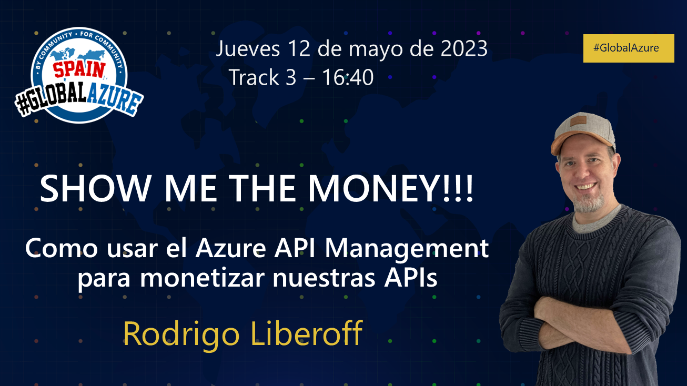

# Como usar el Azure API Management para monetizar nuestras APIs

<h2>El siguiente repo contiene el código fuente que mostré durante una sesión presencial en el Global Azure Spain 2023, en las oficinas de Microsoft Ibérica en Madrid.</h2>

 
  

----------
# Introducción

Este es el repo que acompaña a la publicación en el blog donde os cuento con detalle cómo he implementado un mecanismo de monetización para APIs de Inteligencia Artificial apoyado en el Azure API Management y su Developer Portal.

## Material de la presentación 🎞️

Aquí dejo la presentación en formato [PDF](media/Global%20Azure%202023%20-%20Monetizaci%C3%B3n%20con%20Azure%20API%20Management.pdf) 📕

## Configuración de la aplicación web

La parte del código de demostración que se integracon el Azure API Management (APIM) para la delegación es una aplicación web *dockerizada* e implementada con ASP.NET, Razor, C# y .NET 6.

Al usar Docker, es necesario configurar algunas variables de entorno que podemos colocar donde queramos, aunque habitualmetne yo soy de ponerlas en el `appsettings.json`.

Así, las variables o parámetros de configuración son:

- `ApimServiceOptions:DelegationValidationKey` → La clave generada por el APIM al configurar la delegación.
- `ApimServiceOptions:DeveloperPortalUrl` → La URL al Developer Portal.
- `ApimServiceOptions:ManagementUrl` → La URL que da acceso al API REST para la gestión del APIM. Importante no confundir con la URL del APIM que da acceso a las APIs publicadas, es diferente y suele tener la siguiente forma: `https://apim-demo.management.azure-api.net`
- `ApimServiceOptions:ResourceGroupName` → El nombre de recursos en Azure donde está desplegado el APIM.
- `ApimServiceOptions:ServiceName` → El nombre del APIM *per se*.
- `ApimServiceOptions:SubscriptionId` → El identificador de la subscripción de Azure donde está desplegado el APIM.
- `ApplicationInsights:ConnectionString` → La cadena de conexión a un Application Insigths para dejar trazas.
- `ApplicationInsights:InstrumentationKey` → La clave de instrumentalización del Application Insights.
- `MonetizationOptions:ModelUrl` → La URL a donde tenemos desplejado el JSON correspondiente al modelo de negocio. En la demo, monto el JSON que podemos encontrar [aquí](businessModel/monetizationModels.json) en un Blob Container de un Azure Storage Account con acceso público, lo que me da una URL para llegar hasta él.
- `StripeOptions:ApplicationKey` → La clave de aplicación de Stripe. En el blog explico como generarla.
- `StripeOptions:PublishableKeyPublishableKey` → La clave de publicación de Stripe. Esta se genera automáticamente al crear una cuenta con Stripe. En el blog explico como obtenerla.
- `StripeOptions:WebhookSecret` → El secreto o clave para acceder a un *webhook* mediante el cual Stripe podrá comunicarse con el APIM. También hablo sobre esto en el blog.

¡Vale! Hablo mucho del blog, pero es que allí es donde está el contenido explícito de cómo funciona el código 🤓

## Configuración de la función

La parte del código de demostración que se encarga de reportar consumos a Stripe para que se genere la facturación es una Azure Function también implentada con C# y .NET 6.

Su configuración es significativamente más sencilla, y se compone de los siguientes parámetros:

- `ApimServiceName` → El nombre del APIM *per se*.
- `ApimResourceGroupName` → El nombre de recursos en Azure donde está desplegado el APIM.
- `ApimSubscriptionId` → El identificador de la subscripción de Azure donde está desplegado el APIM.
- `StripeApplicationKey` → La clave de aplicación de Stripe. En el blog explico como generarla.

Por temas de demo, la Azure Function se ejecuta cada minuto. Tened cuidado con esto, quizás para vuestras pruebas o aprendizajes os convenga incrementar el tiempo.

## License

Copyright (c) 2023 — Licenciado bajo la licencia [MIT](LICENSE.txt).

----------
 

  

